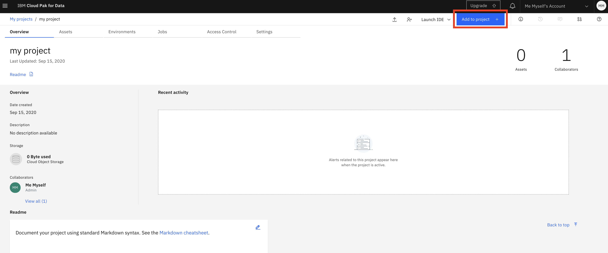

# 17 Sept - Removing Unfair Bias in Machine Learning

To go through the workshop material smoothly it will be easiest when we all use the same setup, especially as it will be harder to help you straight away when you might get stuck during this virtual event. Of course feel free to use your own local machine when you are comfortable with environments and installing missing packages.


I will try to help you when you have issues with the setup, but as time is limited during the workshop it is possible I have to do this later through the ODSC slack channels. I will be there for the full conference.


## Getting started

Start by setting up your free Cloud environment by following [these instructions](https://margriet-groenendijk.gitbook.io/odsc-2020/untitled).

When you have created a Project in Watson Studio the next step is to add a Jupyter notebook with the workshop content.

Click on **Add to project** at the top right.

 You will see the below menu with a list of all assets you can add. Click on **Notebook** to add one.

 This will bring you here, where you can create a new notebook, add one from a local file or from a URL:

To load the first notebook for this workshop, select **From URL**, give the notebook a name, paste the below link in the Notebook URL field and then click the Create button at the bottom right. You can leave the runtime as the default. 

`https://github.com/xxx.ipynb`

### Running a notebook

Now a kernel is initialised and the notebook loaded:

Run each cell in order by selecting it, and then clicking the ▶︎ Run button at the top or use **Shift-Enter**. 

The notebook explores bias in a credit dataset. Find the original data [here](https://archive.ics.uci.edu/ml/datasets/Statlog+%28German+Credit+Data%29) and on [Kaggle](https://www.kaggle.com/uciml/german-credit). 

To go back to the notebook later, go to the Projects page and assets tab. Here you find the notebook. Click on the name to see the code, or the pencil to edit and run the notebook:

