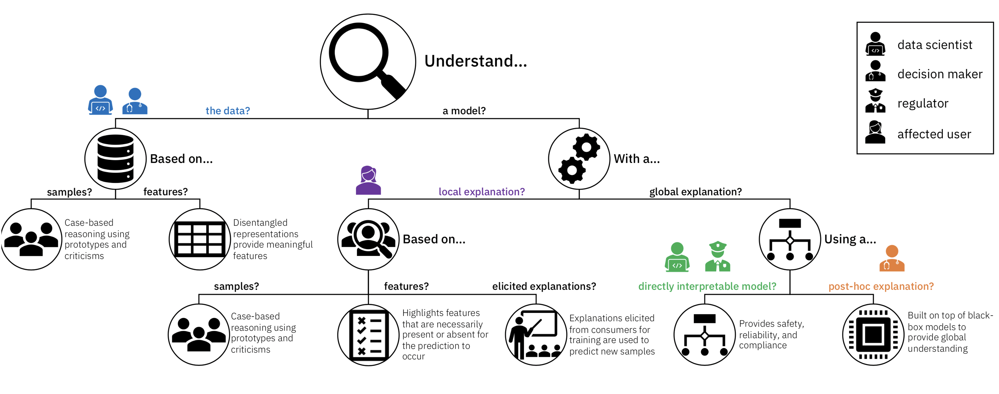
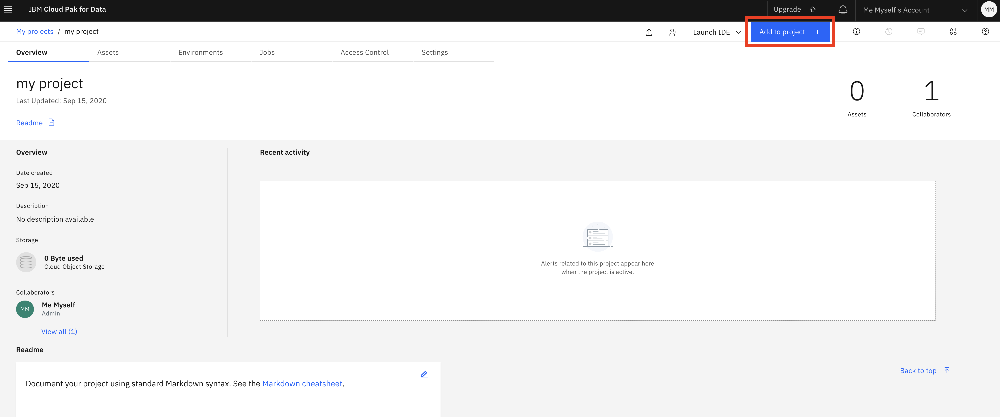
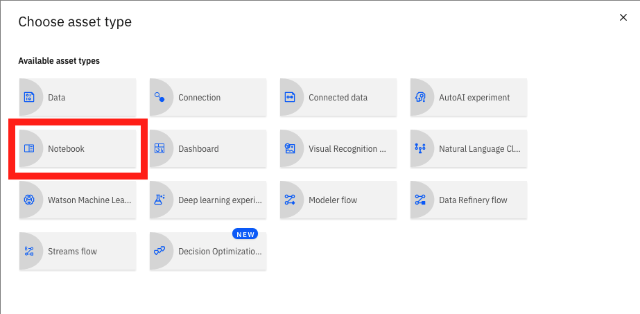
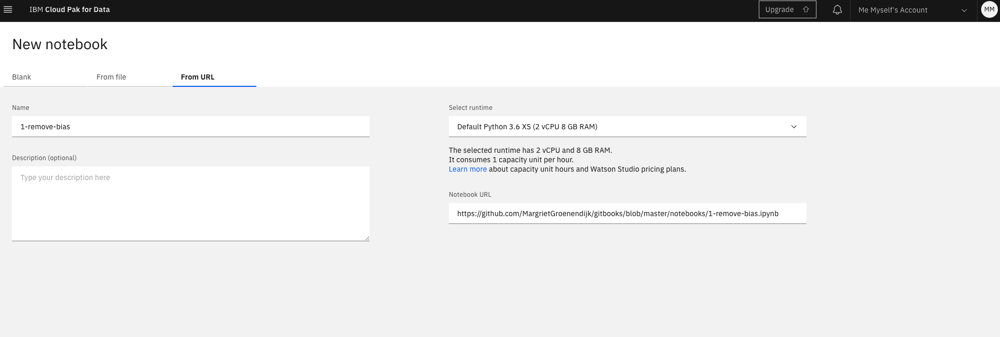
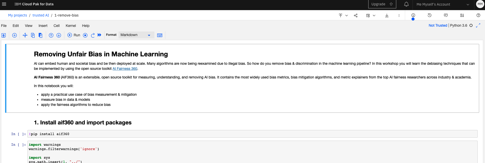
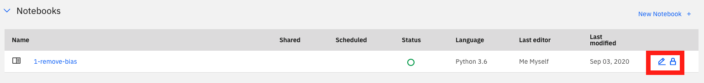

# 18 Sept \(11:30 BST\) - Explain Machine Learning Models

In many applications, trust in an AI system will come from its ability to ‘explain itself.’ But when it comes to understanding and explaining the inner workings of an algorithm, one size does not fit all. Different stakeholders require explanations for different purposes and objectives, and explanations must be tailored to their needs. While a regulator will aim to understand the system as a whole and probe into its logic, consumers affected by a specific decision will be interested only in factors impacting their case – for example, in a loan processing application, they will expect an explanation for why the request was denied and want to understand what changes could lead to approval.

AI Explainability 360 \(AIX360\) is an open source toolkit that includes algorithms that span the different dimensions of ways of explaining along with proxy explainability metrics.

In this workshop you will explore different kinds of explanations suited to different users in the context of a credit approval process enabled by machine learning. The three types of users that we will look at are a data scientist, who evaluates the machine learning model before deployment, a loan officer, who makes the final decision based on the model's output, and a bank customer, who wants to understand the reasons for their application result.

#### 

#### Some house keeping

To go through the workshop material smoothly it will be easiest when we all use the same setup, especially as it will be harder to help you straight away when you might get stuck during this virtual event. Of course feel free to use your own local machine when you are comfortable with environments and installing missing packages to run the **Jupyter notebook**.

Either way please download [this data](https://community.fico.com/s/explainable-machine-learning-challenge?tabset-3158a=2) if you want to follow along


I will try to help you when you have issues with the setup, but as time is limited during the workshop it is possible I have to do this later through the ODSC slack channels. I will be there for the full conference.


#### Session Outline

### Getting started

Run the notebook on your platform of choice. Installation requirements are here, with details on which versions of various packages in the setup.py file. 

Or:

Start by setting up your free Cloud environment by following [these instructions](https://margriet-groenendijk.gitbook.io/odsc-2020/untitled).

When you have created a Project in Watson Studio the next step is to add a Jupyter notebook with the workshop content.

Click on **Add to project** at the top right.

You will see the below menu with a list of all assets you can add. Click on **Notebook** to add one.

This will bring you here, where you can create a new notebook, add one from a local file or from a URL:

To load the first notebook for this workshop, select **From URL**, give the notebook a name, paste the below link in the Notebook URL field and then click the Create button at the bottom right. You can leave the runtime as the default.

`https://github.com/MargrietGroenendijk/gitbooks2/blob/master/files/xxx.ipynb`

#### Running a notebook

Now a kernel is initialised and the notebook loaded:

Run each cell in order by selecting it, and then clicking the ▶︎ Run button at the top or use **Shift-Enter**.

The notebook explores bias in a credit dataset. Find the original data [here](https://archive.ics.uci.edu/ml/datasets/Statlog+%28German+Credit+Data%29) and on [Kaggle](https://www.kaggle.com/uciml/german-credit).

To go back to the notebook later, go to the Projects page and assets tab. Here you find the notebook. Click on the name to see the code, or the pencil to edit and run the notebook:

